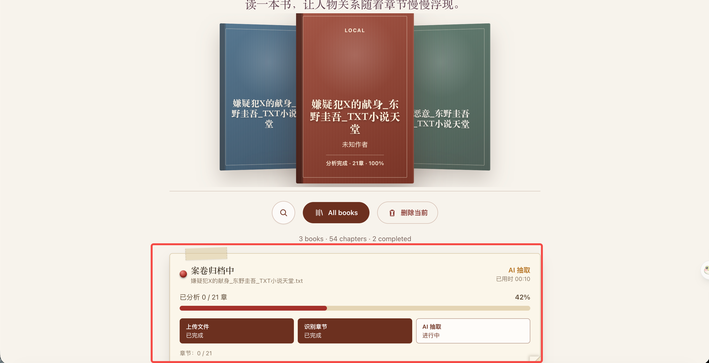
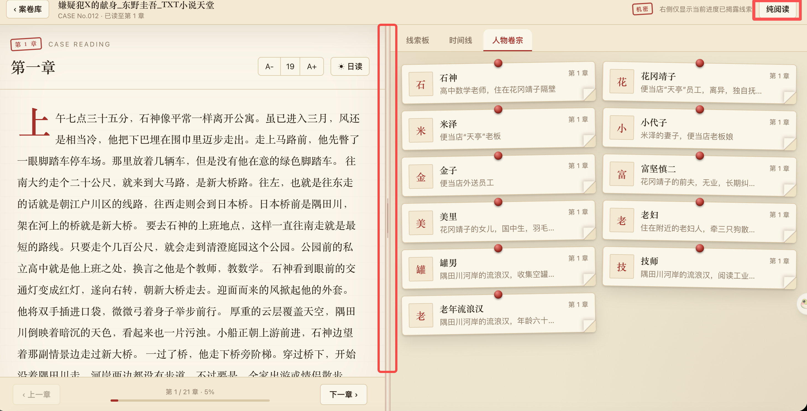
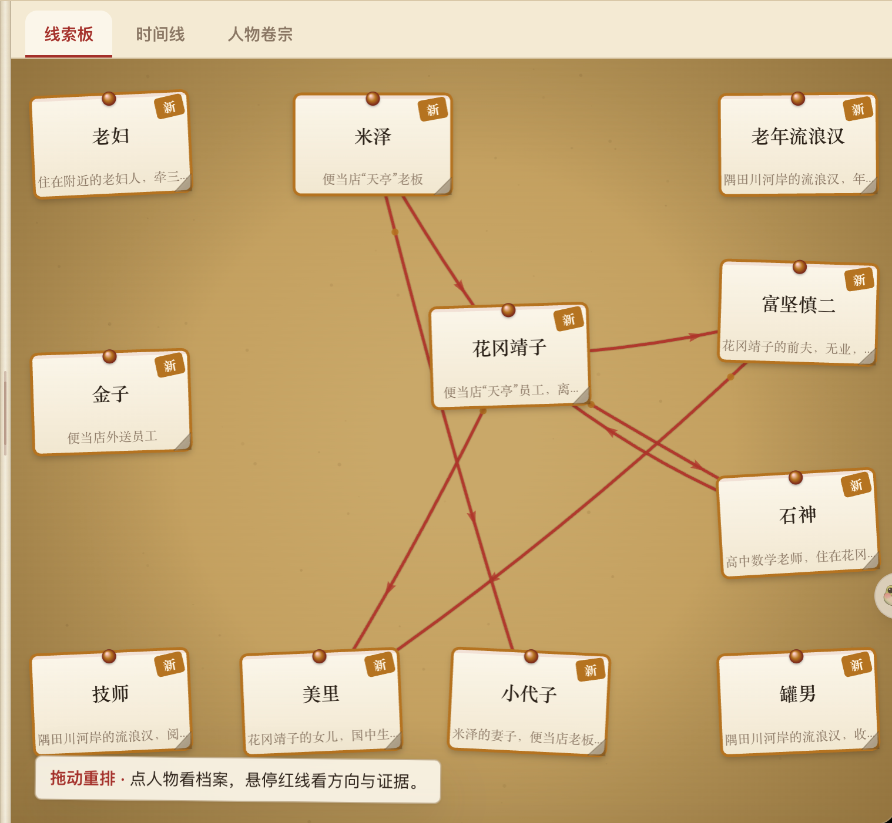
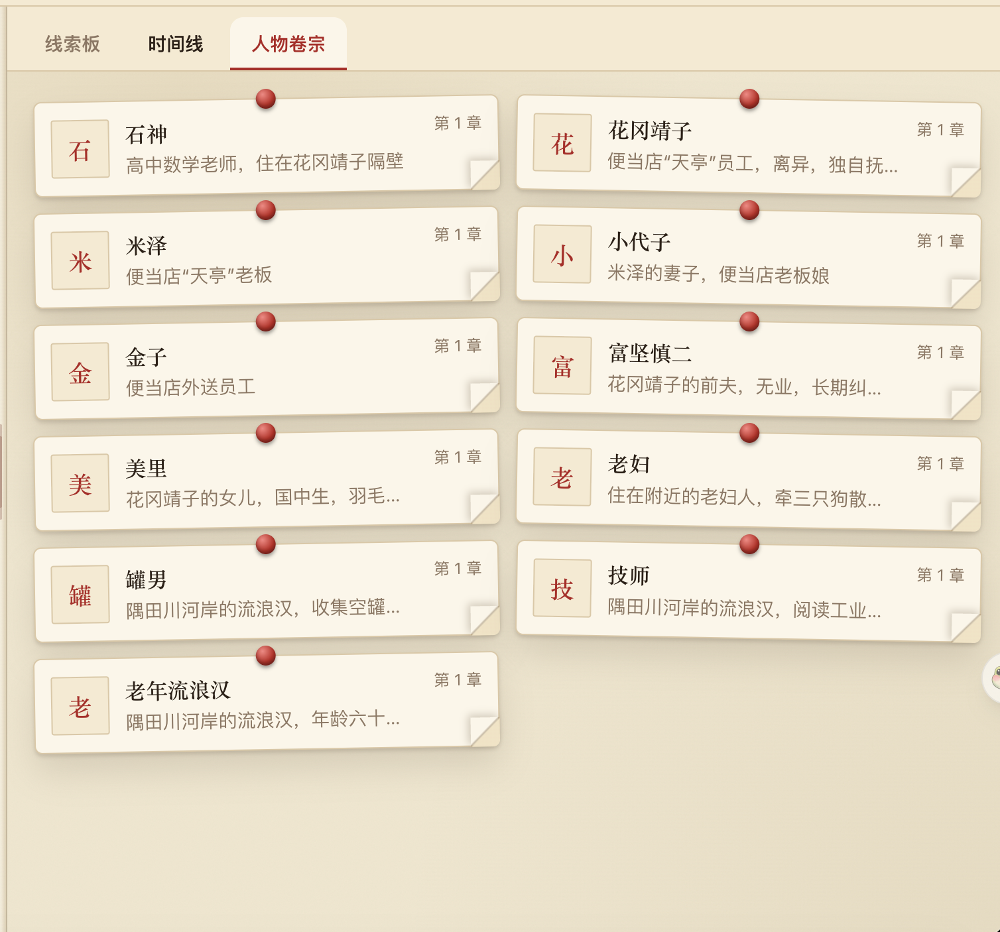

# mystery-reader

> 读《白夜行》到第 300 页，冒出个"XXXXX"，翻回第 80 页才想起来这人是谁。读《三体》，叶文洁和大凤啥关系来着？又忘了。
>
> 复杂小说的人物网，脑子实在记不住。于是我搭了这个工具：**导入一本悬疑小说，AI 自动帮你记住每个角色、每段关系、每条时间线——但绝不剧透。读到哪，看到哪。**

本地全栈悬疑小说阅读器：导入 txt/epub 后，后端在导入阶段调用 OpenAI 兼容接口抽取人物、关系与事件，阅读阶段只从本地 SQLite 读取并按当前章节服务端防剧透过滤。

## 下载安装

macOS 用户可直接下载 DMG 安装包，无需安装 Node 或任何命令行工具：

👉 **[下载 Mystery Reader (macOS DMG)](https://github.com/johnxiong123/mystery-reader/releases)**

## 功能介绍

| 功能 | 说明 | 截图 |
|------|------|------|
| 📚 **3D 书架** | Coverflow 轮播书架，拖拽/滚轮/方向键浏览，支持搜索 |  |
| 🔍 **AI 智能抽取** | 导入 TXT/EPUB 后 AI 逐章抽取人物、关系、事件，实时进度 |  |
| 📖 **沉浸阅读** | 左侧正文 + 右侧关系图分栏，字号调节 + 夜间模式 |  |
| 🔤 **字号调节** | 支持多档字号，一键放大缩小，适配不同阅读习惯 | - |
| 🌙 **夜间模式** | 深色背景 + 暖色文字，夜间护眼阅读 | - |
| 🖥️ **纯阅读模式** | 一键切换纯阅读视图，隐藏右侧面板，专注正文 |  |
| ↔️ **自由分栏** | 中间分隔条可拖拽，自由调整正文与可视化面板的比例 |  |
| 🗺️ **人物关系图** | Canvas 2D 力导向图，按阅读进度生长，揭露动画高亮 |  |
| ⏱️ **事件时间线** | 事件按发生时间排列，倒叙事件特别标注 |  |
| 👤 **人物档案卡** | 点击节点查看人物详情、关联关系、参与事件 |  |
| 🔒 **防剧透** | 所有数据服务端按章节过滤，没读到的绝不泄露 | - |

## 使用说明

### 两种使用模式

| 模式 | 有 API Key | 无 API Key |
|------|-----------|-----------|
| 书架浏览 | ✅ | ✅ |
| 阅读正文 | ✅ | ✅ |
| AI 解析人物/关系/事件 | ✅ | ❌ |
| 关系图 / 时间线 / 档案卡 | ✅ | ❌ |

- **完整模式**：配置 API Key 后导入书籍，AI 逐章自动提取人物、关系、事件。阅读时右侧面板显示关系图、时间线和档案卡。
- **纯阅读模式**：不配 API Key 也能用 —— 浏览书架、打开书籍看正文，只是没有 AI 解析和可视化面板。

### 配置 API Key

**方式一：配置文件（适合 `npm start` 用户）**

```bash
cp .env.example .env
```

编辑 `.env`，填入你的 Key：

```bash
AI_API_KEY=sk-your-key-here
AI_BASE_URL=https://api.openai.com/v1
AI_MODEL=gpt-4o-mini
```

DeepSeek 用户示例：

```bash
AI_BASE_URL=https://api.deepseek.com
AI_MODEL=deepseek-chat
```

**方式二：应用内设置（适合 DMG 用户）**

打开应用后，点击右上角「设置」按钮，在弹出的对话框中填写 API Key 和 Base URL，保存即生效。

### 注意事项

- 🔐 API Key **只存本地**，不会上传到任何服务器。前端代码和日志中不会出现 Key。
- 💰 AI 仅在**导入书籍时**调用，阅读阶段零 API 请求，不消耗额外 token。
- 🌐 支持所有兼容 OpenAI SDK 接口的服务商（OpenAI / DeepSeek / Moonshot / 通义千问 等）。

## 启动

```bash
npm install
cp .env.example .env    # 编辑填入 API Key
npm start
```

浏览器会自动打开 `http://localhost:8787`。

## 开发

详见 [CONTRIBUTING.md](./CONTRIBUTING.md)（本地开发、DMG 打包、验收脚本等）。
